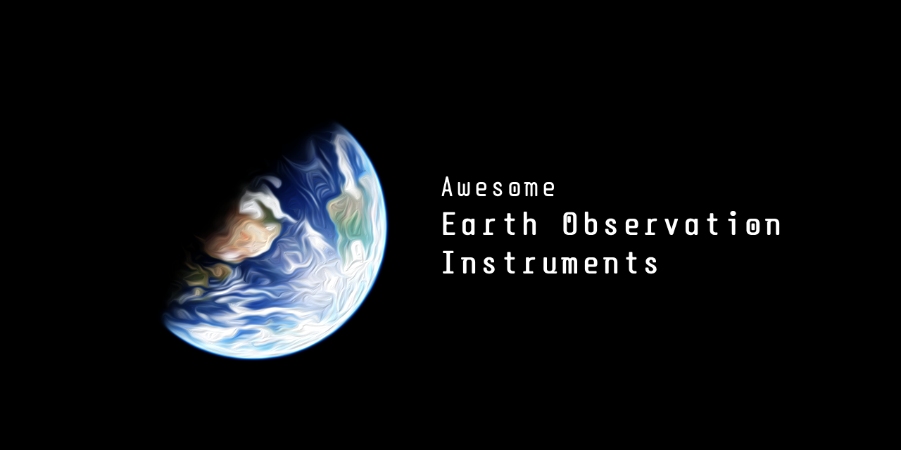

  

    <em>A machine-readable catalogue of Earth observation instruments with spectral, spatial, temporal, and operational characteristics</em>

---

**GitHub**: <a href="https://github.com/awesome-spectral-indices/awesome-earth-observation-instruments" target="_blank">https://github.com/awesome-spectral-indices/awesome-earth-observation-instruments</a>

---

# Earth Observation

Earth observation (EO) instruments measure our planet from satellites, aircraft, drones, and ground systems.
They capture information about land, oceans, atmosphere, ice, and human activity, helping both experts and the public understand environmental change.

This catalogue organizes EO instrument metadata in a consistent, machine-readable format.
The goal is to make comparison, discovery, and downstream use easier for research, operations, and education.

# Schema

The core schema defines the common metadata required for every instrument, such as identifier, platform, status, operators, and reference links.
Using a single core structure improves interoperability across missions, agencies, and processing systems.

In practical terms, the core schema makes data exchange more reliable:
- developers can validate files automatically,
- analysts can query instrument metadata consistently,
- users can trace information back to references and data access links.

Additionally, we added some extensions to the core schema. They add domain-specific details without changing the core model:
- `spectral` for band and wavelength information,
- `imaging` for optical and geometric parameters,
- `data_access` for data access metadata, with access points such as Google Earth Engine and Microsoft Planetary Computer.
- `cross_links` for links to matching instrument records in external catalogues and indexes.

This modular design keeps the catalogue flexible.
Simple instruments can use only the core fields, while advanced instruments can provide richer spectral and platform access details.

See the [schema specification](SCHEMA.md) for the complete list of core and extension properties.

# Catalogue

This section organizes instruments by platform type and sensing modality to make discovery and comparison easier.
Use the table of contents below to jump directly to available categories and subcategories.

## Table of Contents
- [Satellite Instruments](#catalogue-satellite-instruments)
  - [Multispectral](#catalogue-satellite-multispectral)
  - [Hyperspectral](#catalogue-satellite-hyperspectral)
- [Uav Instruments](#catalogue-uav-instruments)
  - [Multispectral](#catalogue-uav-multispectral)
  - [Rgb](#catalogue-uav-rgb)

## Satellite Instruments

### Multispectral

| Id | Name | Platforms | Status | Earth Engine | Planetary Computer |
| --- | --- | --- | --- | --- | --- |
| [ASTER](https://awesome-spectral-indices.github.io/awesome-earth-observation-instruments/instruments/ASTER) | Advanced Spaceborne Thermal Emission and Reflection Radiometer | Terra | **operational :white_check_mark:** | [:link: link](https://developers.google.com/earth-engine/datasets/catalog/ASTER_AST_L1T_003) | [:link: link](https://planetarycomputer.microsoft.com/dataset/aster-l1t) |
| [ETM_L7](https://awesome-spectral-indices.github.io/awesome-earth-observation-instruments/instruments/ETM_L7) | Enhanced Thematic Mapper Plus | Landsat 7 | **operational :white_check_mark:** | [:link: link](https://developers.google.com/earth-engine/datasets/catalog/LANDSAT_LE07_C02_T1_L2) | [:link: link](https://planetarycomputer.microsoft.com/dataset/landsat-c2-l2) |
| [MODIS_AQUA](https://awesome-spectral-indices.github.io/awesome-earth-observation-instruments/instruments/MODIS_AQUA) | Moderate Resolution Imaging Spectroradiometer | Aqua | **operational :white_check_mark:** | [:link: link](https://developers.google.com/earth-engine/datasets/catalog/MODIS_061_MCD43A4) | [:link: link](https://planetarycomputer.microsoft.com/dataset/modis-43A4-061) |
| [MODIS_TERRA](https://awesome-spectral-indices.github.io/awesome-earth-observation-instruments/instruments/MODIS_TERRA) | Moderate Resolution Imaging Spectroradiometer | Terra | **operational :white_check_mark:** | [:link: link](https://developers.google.com/earth-engine/datasets/catalog/MODIS_061_MCD43A4) | [:link: link](https://planetarycomputer.microsoft.com/dataset/modis-43A4-061) |
| [MSI_S2A](https://awesome-spectral-indices.github.io/awesome-earth-observation-instruments/instruments/MSI_S2A) | MultiSpectral Instrument | Sentinel-2A | **operational :white_check_mark:** | [:link: link](https://developers.google.com/earth-engine/datasets/catalog/COPERNICUS_S2_SR_HARMONIZED) | [:link: link](https://planetarycomputer.microsoft.com/dataset/sentinel-2-l2a) |
| [MSI_S2B](https://awesome-spectral-indices.github.io/awesome-earth-observation-instruments/instruments/MSI_S2B) | MultiSpectral Instrument | Sentinel-2B | **operational :white_check_mark:** | [:link: link](https://developers.google.com/earth-engine/datasets/catalog/COPERNICUS_S2_SR_HARMONIZED) | [:link: link](https://planetarycomputer.microsoft.com/dataset/sentinel-2-l2a) |
| [MSI_S2C](https://awesome-spectral-indices.github.io/awesome-earth-observation-instruments/instruments/MSI_S2C) | MultiSpectral Instrument | Sentinel-2C | **operational :white_check_mark:** | [:link: link](https://developers.google.com/earth-engine/datasets/catalog/COPERNICUS_S2_SR_HARMONIZED) | [:link: link](https://planetarycomputer.microsoft.com/dataset/sentinel-2-l2a) |
| [MSS_L1](https://awesome-spectral-indices.github.io/awesome-earth-observation-instruments/instruments/MSS_L1) | Multispectral Scanner System | Landsat 1 | **retired :no_entry:** | [:link: link](https://developers.google.com/earth-engine/datasets/catalog/LANDSAT_LM01_C02_T1) | [:link: link](https://planetarycomputer.microsoft.com/dataset/landsat-c2-l1) |
| [MSS_L2](https://awesome-spectral-indices.github.io/awesome-earth-observation-instruments/instruments/MSS_L2) | Multispectral Scanner System | Landsat 2 | **retired :no_entry:** | [:link: link](https://developers.google.com/earth-engine/datasets/catalog/LANDSAT_LM02_C02_T1) | [:link: link](https://planetarycomputer.microsoft.com/dataset/landsat-c2-l1) |
| [MSS_L3](https://awesome-spectral-indices.github.io/awesome-earth-observation-instruments/instruments/MSS_L3) | Multispectral Scanner System | Landsat 3 | **retired :no_entry:** | [:link: link](https://developers.google.com/earth-engine/datasets/catalog/LANDSAT_LM03_C02_T1) | [:link: link](https://planetarycomputer.microsoft.com/dataset/landsat-c2-l1) |
| [MSS_L4](https://awesome-spectral-indices.github.io/awesome-earth-observation-instruments/instruments/MSS_L4) | Multispectral Scanner System | Landsat 4 | **retired :no_entry:** | [:link: link](https://developers.google.com/earth-engine/datasets/catalog/LANDSAT_LM04_C02_T1) | [:link: link](https://planetarycomputer.microsoft.com/dataset/landsat-c2-l1) |
| [MSS_L5](https://awesome-spectral-indices.github.io/awesome-earth-observation-instruments/instruments/MSS_L5) | Multispectral Scanner System | Landsat 5 | **retired :no_entry:** | [:link: link](https://developers.google.com/earth-engine/datasets/catalog/LANDSAT_LM05_C02_T1) | [:link: link](https://planetarycomputer.microsoft.com/dataset/landsat-c2-l1) |
| [OLCI_S3A](https://awesome-spectral-indices.github.io/awesome-earth-observation-instruments/instruments/OLCI_S3A) | Ocean and Land Colour Instrument | Sentinel-3A | **operational :white_check_mark:** | [:link: link](https://developers.google.com/earth-engine/datasets/catalog/COPERNICUS_S3_OLCI) | [:link: link](https://planetarycomputer.microsoft.com/dataset/sentinel-3-olci-lfr-l2-netcdf) |
| [OLCI_S3B](https://awesome-spectral-indices.github.io/awesome-earth-observation-instruments/instruments/OLCI_S3B) | Ocean and Land Colour Instrument | Sentinel-3B | **operational :white_check_mark:** | [:link: link](https://developers.google.com/earth-engine/datasets/catalog/COPERNICUS_S3_OLCI) | [:link: link](https://planetarycomputer.microsoft.com/dataset/sentinel-3-olci-lfr-l2-netcdf) |
| [OLI2_L9](https://awesome-spectral-indices.github.io/awesome-earth-observation-instruments/instruments/OLI2_L9) | Operational Land Imager 2 | Landsat 9 | **operational :white_check_mark:** | [:link: link](https://developers.google.com/earth-engine/datasets/catalog/LANDSAT_LC09_C02_T1_L2) | [:link: link](https://planetarycomputer.microsoft.com/dataset/landsat-c2-l2) |
| [OLI_L8](https://awesome-spectral-indices.github.io/awesome-earth-observation-instruments/instruments/OLI_L8) | Operational Land Imager | Landsat 8 | **operational :white_check_mark:** | [:link: link](https://developers.google.com/earth-engine/datasets/catalog/LANDSAT_LC08_C02_T1_L2) | [:link: link](https://planetarycomputer.microsoft.com/dataset/landsat-c2-l2) |
| [TIRS2_L9](https://awesome-spectral-indices.github.io/awesome-earth-observation-instruments/instruments/TIRS2_L9) | Thermal Infrared Sensor 2 | Landsat 9 | **operational :white_check_mark:** | [:link: link](https://developers.google.com/earth-engine/datasets/catalog/LANDSAT_LC09_C02_T1_L2) | [:link: link](https://planetarycomputer.microsoft.com/dataset/landsat-c2-l2) |
| [TIRS_L8](https://awesome-spectral-indices.github.io/awesome-earth-observation-instruments/instruments/TIRS_L8) | Thermal Infrared Sensor | Landsat 8 | **operational :white_check_mark:** | [:link: link](https://developers.google.com/earth-engine/datasets/catalog/LANDSAT_LC08_C02_T1_L2) | [:link: link](https://planetarycomputer.microsoft.com/dataset/landsat-c2-l2) |
| [TM_L4](https://awesome-spectral-indices.github.io/awesome-earth-observation-instruments/instruments/TM_L4) | Thematic Mapper | Landsat 4 | **retired :no_entry:** | [:link: link](https://developers.google.com/earth-engine/datasets/catalog/LANDSAT_LT04_C02_T1_L2) | [:link: link](https://planetarycomputer.microsoft.com/dataset/landsat-c2-l2) |
| [TM_L5](https://awesome-spectral-indices.github.io/awesome-earth-observation-instruments/instruments/TM_L5) | Thematic Mapper | Landsat 5 | **retired :no_entry:** | [:link: link](https://developers.google.com/earth-engine/datasets/catalog/LANDSAT_LT05_C02_T1_L2) | [:link: link](https://planetarycomputer.microsoft.com/dataset/landsat-c2-l2) |

### Hyperspectral

| Id | Name | Platforms | Status | Earth Engine | Planetary Computer |
| --- | --- | --- | --- | --- | --- |
| [EMIT](https://awesome-spectral-indices.github.io/awesome-earth-observation-instruments/instruments/EMIT) | Earth Surface Mineral Dust Source Investigation | ISS | **operational :white_check_mark:** | [:link: link](https://developers.google.com/earth-engine/datasets/catalog/NASA_EMIT_L2A_RFL) |  |

## Uav Instruments

### Multispectral

| Id | Name | Platforms | Status | Earth Engine | Planetary Computer |
| --- | --- | --- | --- | --- | --- |
| [ALTUMAL04_lte_MICASENSE](https://awesome-spectral-indices.github.io/awesome-earth-observation-instruments/instruments/ALTUMAL04_lte_MICASENSE) | Altum AL04 (or lower) Series | UAV | **legacy :no_entry:** |  |  |
| [ALTUMAL05_MICASENSE](https://awesome-spectral-indices.github.io/awesome-earth-observation-instruments/instruments/ALTUMAL05_MICASENSE) | Altum AL05 Series | UAV | **legacy :no_entry:** |  |  |
| [ALTUMAL06_gte_MICASENSE](https://awesome-spectral-indices.github.io/awesome-earth-observation-instruments/instruments/ALTUMAL06_gte_MICASENSE) | Altum AL06 (or greater) Series | UAV | **legacy :no_entry:** |  |  |
| [ALTUMPT_MICASENSE](https://awesome-spectral-indices.github.io/awesome-earth-observation-instruments/instruments/ALTUMPT_MICASENSE) | Altum-PT | UAV | **active :white_check_mark:** |  |  |
| [REDEDGE3_MICASENSE](https://awesome-spectral-indices.github.io/awesome-earth-observation-instruments/instruments/REDEDGE3_MICASENSE) | RedEdge-3 | UAV | **legacy :no_entry:** |  |  |
| [REDEDGEMX_RX01_MICASENSE](https://awesome-spectral-indices.github.io/awesome-earth-observation-instruments/instruments/REDEDGEMX_RX01_MICASENSE) | RedEdge-MX RX01 Series | UAV | **legacy :no_entry:** |  |  |
| [REDEDGEMX_RX02_gte_MICASENSE](https://awesome-spectral-indices.github.io/awesome-earth-observation-instruments/instruments/REDEDGEMX_RX02_gte_MICASENSE) | RedEdge-MX RX02 (or greater) Series | UAV | **legacy :no_entry:** |  |  |
| [REDEDGEM_MICASENSE](https://awesome-spectral-indices.github.io/awesome-earth-observation-instruments/instruments/REDEDGEM_MICASENSE) | RedEdge-M | UAV | **legacy :no_entry:** |  |  |
| [REDEDGEP_MICASENSE](https://awesome-spectral-indices.github.io/awesome-earth-observation-instruments/instruments/REDEDGEP_MICASENSE) | RedEdge-P | UAV | **active :white_check_mark:** |  |  |
| [SEQUOIA_MULTISPECTRAL_PARROT](https://awesome-spectral-indices.github.io/awesome-earth-observation-instruments/instruments/SEQUOIA_MULTISPECTRAL_PARROT) | Sequoia Multispectral Sensor | UAV | **active :white_check_mark:** |  |  |

### Rgb

| Id | Name | Platforms | Status | Earth Engine | Planetary Computer |
| --- | --- | --- | --- | --- | --- |
| [SEQUOIA_RGB_PARROT](https://awesome-spectral-indices.github.io/awesome-earth-observation-instruments/instruments/SEQUOIA_RGB_PARROT) | Sequoia RGB Camera | UAV | **active :white_check_mark:** |  |  |

---

> [!WARNING]  
> This README.md is generated automatically from source files in `src/instruments/` via `src/code/catalogue.py` and `src/code/readme.py`. DO NOT MODIFY THIS FILE DIRECTLY.
